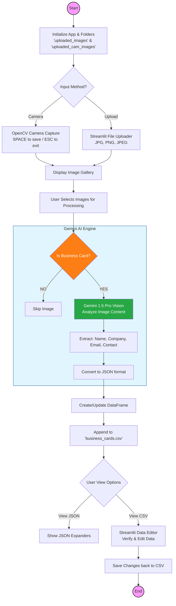

# 📇 Intelligent Business Card Intelligence System

This enterprise-grade application automates the conversion of physical business cards into digital database records. Utilizing **Gemini 1.5 Pro's Vision-AI**, it bypasses traditional OCR limitations by understanding the layout, typography, and semantic context of professional contact information.

---

## 🏗️ System Architecture

The application is built on a **Visual-to-Structured Data Pipeline**, allowing for dual-input methods (live camera scan or batch upload) and multi-format data persistence.

### 1. Multi-Modal Input Layer
* **Live Capture (OpenCV):** Features an integrated camera interface that allows users to capture business cards in real-time. Frames are processed through `cv2` and cached locally for analysis.
* **Batch Ingestion:** Supports high-resolution image uploads (JPG, PNG) with a grid-based preview system powered by **PIL (Pillow)**.

### 2. Cognitive Recognition Layer
The system employs a **Two-Stage AI Validation** process:
1.  **Card Classification:** Before processing, the image is sent to Gemini to verify if it is actually a business card. It returns a boolean `YES/NO` to prevent the processing of non-relevant imagery.
2.  **Semantic Extraction:** If validated, the Vision-AI performs a deep scan to extract:
    * **Contact Information:** Names (supporting multiple names per card), Emails, and Phone Numbers.
    * **Organizational Context:** Full Company Names.

### 3. Data Orchestration & Persistence
* **JSON-to-Relational Mapping:** The LLM's raw JSON output is normalized into a **Pandas DataFrame**.
* **Persistent Storage:** Data is appended to a local `business_cards.csv`, creating a historical record that survives application restarts.
* **Interactive Editing:** Utilizes Streamlit’s `data_editor` to allow users to manually verify and correct AI-extracted data in real-time before final commitment.

---

## 🛠️ Tech Stack

| Component | Technology |
| :--- | :--- |
| **Vision Model** | Google Gemini 1.5 Pro |
| **App Framework** | Streamlit |
| **Image Processing** | OpenCV (`cv2`) & Pillow (`PIL`) |
| **Data Analysis** | Pandas & NumPy |
| **Logic Engine** | LangChain Core |

---

## 🧠 Functional Workflow

The system manages the lifecycle of a digital contact through four distinct stages:


1.  **Acquisition:** The user either triggers the `capture_images()` function via webcam or uploads files to the `IMAGE_FOLDER`.
2.  **Validation:** Gemini performs a quick check: `tell clean 'YES' if it is it else clean 'NO'`.
3.  **Extraction:** The system sends a structured prompt with a predefined JSON schema. It specifically handles edge cases like cards with multiple owners by mapping them to `Person name` and `Person name 2`.
4.  **Refinement:** The extracted data is displayed in an editable table. Users can click cells to modify information, and the `edited_df.to_csv()` trigger saves changes instantly.

---

## 📊 Technical Specifications

### Semantic Extraction Logic
The prompt engineering ensures that the LLM returns "Pure JSON" without markdown artifacts, which are then safely evaluated using `ast.literal_eval`.

```python
# Multi-name handling logic
for item in extracted_data:
    person_name = item.get("Person name", "")
    person_name_2 = item.get("Person name 2", "")
    row = {
        "Person name": f"{person_name}, {person_name_2}",
        "Company name": item.get("Company name", ""),
        "Email": item.get("Email", ""),
        "Contact number": item.get("Contact number", ""),
    }
```
## Logic Flowchart



### Vision Prompts & Guardrails
To maintain data integrity, the system uses a **Negative Constraint Prompt**:
> *"Your response shall not contain ' ```json ' and ' ``` ' ... if a card has multiple person name then the output be like..."*

This prevents parsing errors and ensures the system can handle professional cards with co-founders or multiple representatives effectively.

### Persistence Layer
The application uses a **Concatenation Strategy** for the CSV database:
1.  Check for `csv_exists`.
2.  If found, `pd.concat` the existing records with the new batch.
3.  Rewrite to disk, ensuring no data loss during concurrent processing sessions.
